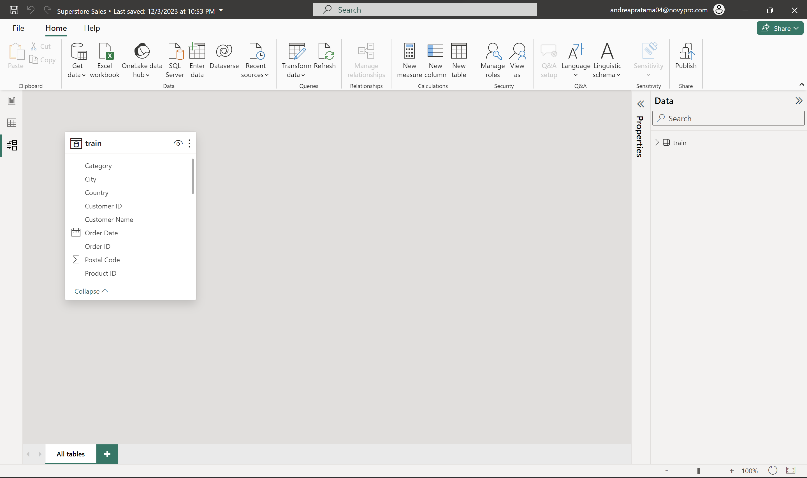
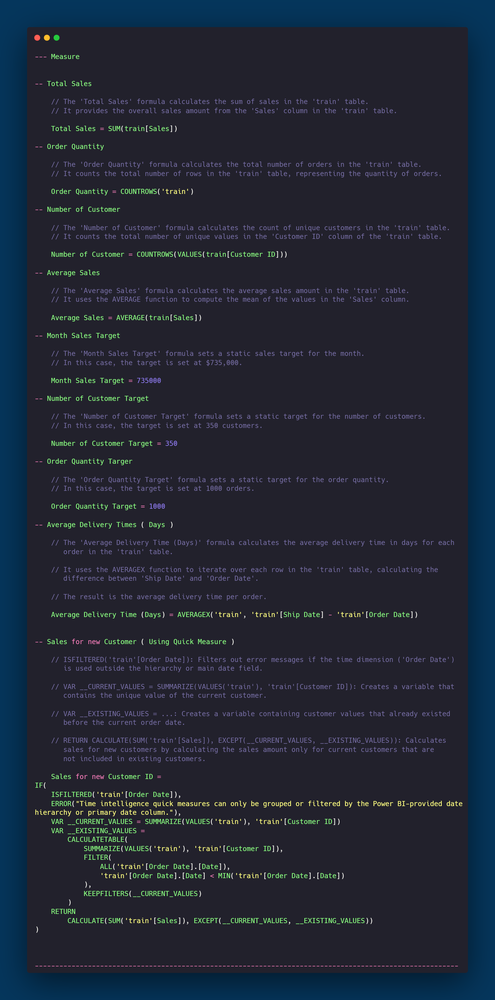

# Superstore Sales

## Introduction

Welcome to the Superstore Sales Analysis project! This initiative stems from the necessity of the Superstore to comprehensively analyze its sales performance. The project delves into the sales data, aiming to uncover trends, identify growth opportunities, analyze customer behavior, and monitor product performance.

## Problem Statement

The retail business faces challenges in understanding sales trends, identifying opportunities for revenue growth, and making informed decisions. This project aims to address these challenges by creating a comprehensive Power BI dashboard.

## Skill Demonstrated

- Power BI Dashboard Design
- DAX (Data Analysis Expressions)
- Filter
- Button
- Insightful Data Presentation
- Effective Communication through Visualization
- Data-Driven Decision-Making

## Data Sourcing

The dataset used for this analysis was sourced from [Kaggle](https://www.kaggle.com/), providing a rich and diverse set of Superstore sales data to extract valuable insights.

## Data Transformation

The data underwent transformation processes, ensuring its compatibility with Power BI. Techniques such as cleaning, filtering, and shaping were applied using DAX and prepare the data for analysis.

## Modeling

DAX measures were employed to create an effective model for analyzing sales trends, facilitating accurate and precise reporting within the Power BI environment.

- Dax that I used in this project.

Crate Measure 

## Analyze & Visualization

The Power BI dashboard presents an intuitive visualization of sales trends, providing stakeholders with a clear understanding of the data. Various charts and graphs were used to highlight key performance indicators, enabling users to derive actionable insights.

### This Report have 3 pages :
- Dashboard Overview
- Monthly Performance
- Detailed Customer 

## Conclusion & Recommendation

In conclusion, the Superstore Sales Analysis project demonstrates the ability to transform raw sales data into meaningful insights. The dashboard's potential to boost revenue by at least 7% signifies its impact on strategic decision-making. Recommendations for future enhancements include continuous data monitoring and the incorporation of additional data sources for a more comprehensive analysis.

----------------------------------------------------------------------------------------------------------------------------------------------------------------------------------------------------
